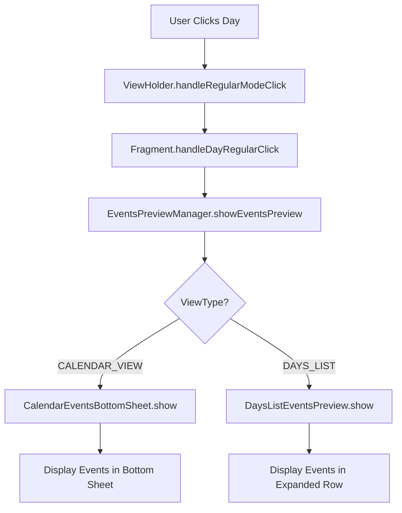
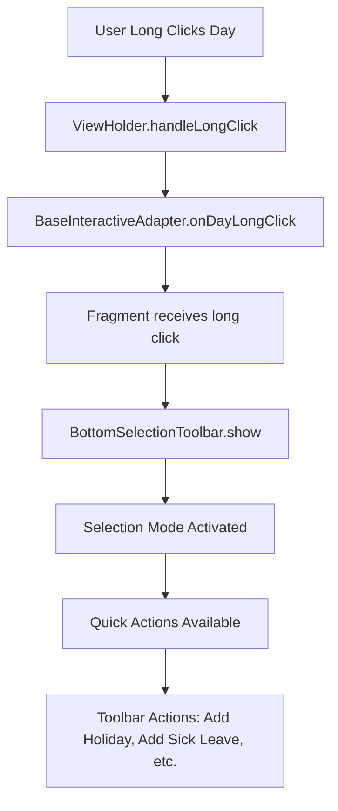

## 📋 Table of Contents

1. [Architecture Overview](#architecture-overview)
2. [Package Structure](#package-structure)
3. [Core Infrastructure](#core-infrastructure)
4. [Feature Development](#feature-development)
5. [Dependency Injection](#dependency-injection)
6. [Click Events & Interaction System](#click-events--interaction-system)
7. [Best Practices](#best-practices)
8. [Examples](#examples)
9. [Migration Guide](#migration-guide)
10. [Advanced Topics](#advanced-topics)

### Example 4: Click Events Integration

#### Calendar Click Handling
```java
public class CalendarViewFragment extends BaseInteractiveFragment {
    
    @Override
    protected EventsPreviewManager.ViewType getEventsPreviewViewType() {
        return EventsPreviewManager.ViewType.CALENDAR_VIEW;
    }
    
    @Override
    protected void handleDayRegularClick(Day day, LocalDate date, View anchorView, int position) {
        // Get events for clicked date
        List<LocalEvent> events = getEventsForDate(date);
        
        // Show events preview using bottom sheet
        mEventsPreviewManager.showEventsPreview(date, events, anchorView);
        
        Log.d(TAG, "Calendar regular click: " + date + " with " + events.size() + " events");
    }
    
    @Override
    protected void handleDayLongClick(Day day, LocalDate date, View anchorView, int position) {
        // Enter selection mode for bulk operations
        if (!isSelectionMode()) {
            enterSelectionMode();
            showBottomSelectionToolbar();
        }
        
        // Toggle date selection
        toggleDateSelection(date);
        updateSelectionUI();
        
        Log.d(TAG, "Calendar long click: " + date + ", selection mode active");
    }
}
```

#### DaysList Click Handling
```java
public class DayslistViewFragment extends BaseInteractiveFragment {
    
    @Override
    protected EventsPreviewManager.ViewType getEventsPreviewViewType() {
        return EventsPreviewManager.ViewType.DAYS_LIST;
    }
    
    @Override
    protected void handleDayRegularClick(Day day, LocalDate date, View anchorView, int position) {
        // Get events for clicked date
        List<LocalEvent> events = getEventsForDate(date);
        
        // Show events preview using expansion (future) or placeholder
        mEventsPreviewManager.showEventsPreview(date, events, anchorView);
        
        Log.d(TAG, "DaysList regular click: " + date + " with " + events.size() + " events");
    }
    
    @Override
    protected void onQuickEventCreated(ToolbarAction action, LocalDate date) {
        Log.d(TAG, "DaysList: Quick event created: " + action + " for date: " + date);
        
        // Refresh data to show the new event
        loadDaysListData();
        
        // Update events indicators
        if (mDaysListModule != null) {
            mDaysListModule.configureEventsIntegration();
        }
    }
}
```

#### Events Preview Manager Integration
```java
public class CustomEventsPreviewManager {
    
    public void setupEventsPreview(Fragment fragment, ViewType viewType) {
        // Initialize based on view type
        EventsPreviewManager previewManager = new EventsPreviewManager(
            fragment.requireContext(), viewType);
        
        // Set up event listeners
        previewManager.setEventsPreviewListener(new EventsPreviewListener() {
            @Override
            public void onEventQuickAction(EventQuickAction action, LocalEvent event, LocalDate date) {
                switch (action) {
                    case EDIT:
                        fragment.navigateToEventEditor(event, date);
                        break;
                    case DELETE:
                        fragment.showDeleteEventConfirmation(event);
                        break;
                    case DUPLICATE:
                        fragment.duplicateEvent(event, date);
                        break;
                }
            }
            
            @Override
            public void onEventsGeneralAction(EventGeneralAction action, LocalDate date) {
                switch (action) {
                    case ADD_EVENT:
                        fragment.navigateToEventCreator(date);
                        break;
                    case NAVIGATE_TO_EVENTS_ACTIVITY:
                        fragment.openEventsActivity(date);
                        break;
                    case REFRESH_EVENTS:
                        fragment.refreshEventsData();
                        break;
                }
            }
        });
    }
}
```

---

## 🖱️ Click Events & Interaction System

### Overview

The click events system implements a modular architecture that differentiates behavior between Calendar View and DaysList View, providing specialized user interactions for each view type.

### Architecture Pattern

#### Class Hierarchy

The system follows a layered inheritance pattern with specialized functionality:

```java
// Base Layer - Data Management
BaseFragment
├── Data management and lifecycle
├── Events cache (mEventsCache)
├── EventsRefreshInterface implementation
└── Methods: getEventsForDate(), refreshEventsData()

// Interactive Layer - Click Handling  
BaseInteractiveFragment extends BaseFragment
├── DayLongClickListener implementation
├── Selection mode management
├── EventsPreviewManager integration
├── Abstract methods for subclasses:
│   ├── getClickAdapter()
│   └── getEventsPreviewViewType()
```

#### Fragment Implementations

```java
// Calendar Fragment
public class CalendarViewFragment extends BaseInteractiveFragment {
    @Override
    protected EventsPreviewManager.ViewType getEventsPreviewViewType() {
        return EventsPreviewManager.ViewType.CALENDAR_VIEW;
    }
    
    @Override
    protected BaseInteractiveAdapter getClickAdapter() {
        return mCalendarAdapter; // 7-column grid layout
    }
}

// DaysList Fragment  
public class DayslistViewFragment extends BaseInteractiveFragment {
    @Override
    protected EventsPreviewManager.ViewType getEventsPreviewViewType() {
        return EventsPreviewManager.ViewType.DAYS_LIST;
    }
    
    @Override
    protected BaseInteractiveAdapter getClickAdapter() {
        return mDaysListAdapter; // 1-column list layout
    }
}
```

### Adapter Architecture

#### Adapter Hierarchy

```java
// Base Layer
BaseAdapter
├── Common data binding
├── ViewHolder management
└── Shared functionality

// Interactive Layer
BaseInteractiveAdapter extends BaseAdapter
├── DayLongClickListener implementation
├── Selection mode support
├── LongClickCapable interface for ViewHolders
└── DayRegularClickListener for normal clicks

// Specialized Implementations
CalendarAdapter extends BaseInteractiveAdapter
├── CalendarDayViewHolder (48x48dp cells)
├── Compact events indicator
└── Grid layout optimization

DaysListAdapter extends BaseInteractiveAdapter  
├── DayslistDayViewHolder (56dp height rows)
├── Integrated events indicator
└── List layout optimization
```

#### ViewHolder Integration

```java
public class BaseMaterialDayViewHolder implements LongClickCapable {
    
    private void setupClickListener() {
        itemView.setOnClickListener(v -> {
            if (mIsSelectionMode) {
                handleSelectionModeClick(); // Toggle selection
            } else {
                handleRegularModeClick(); // Show events preview
            }
        });
    }
    
    private void handleRegularModeClick() {
        if (mRegularClickListener != null && mCurrentDay != null) {
            mRegularClickListener.onDayRegularClick(
                mCurrentDay, mCurrentDate, itemView, mCurrentPosition);
        }
    }
    
    private void handleSelectionModeClick() {
        if (mLongClickListener != null && mCurrentDay != null) {
            mLongClickListener.onDayLongClick(
                mCurrentDay, mCurrentDate, itemView, mCurrentPosition);
        }
    }
}
```

### Events Preview System

#### EventsPreviewManager - Router Pattern

The EventsPreviewManager acts as a router that delegates to the correct implementation based on ViewType:

```java
public class EventsPreviewManager {
    
    public enum ViewType {
        DAYS_LIST,      // List view with expandable rows
        CALENDAR_VIEW   // Grid view with compact cells
    }
    
    private void initializeImplementation(ViewType viewType) {
        switch (viewType) {
            case DAYS_LIST:
                mCurrentImplementation = new DaysListEventsPreview(mContext);
                break;
            case CALENDAR_VIEW:
                mCurrentImplementation = new CalendarEventsBottomSheet(mContext);
                break;
        }
    }
}
```

#### Implementation Strategies

**CalendarEventsBottomSheet**
- **UI Pattern**: Bottom Sheet Dialog
- **Rationale**: Small calendar cells (48x48dp) need modal overlay
- **Features**:
  - Formatted date header
  - RecyclerView with EventsAdapter
  - Action buttons (Add Event, Navigate to EventsActivity)
  - Empty state management

**DaysListEventsPreview**
- **UI Pattern**: In-place expansion (Future: Phase 3)
- **Current**: Toast placeholder for development
- **Rationale**: Larger list rows (56dp) have space for expansion
- **Future Features**:
  - MaterialCardView expansion animation
  - Inline events list
  - Quick action buttons

### Click Flow Implementation

#### Regular Click Flow (Events Preview)



**Implementation**:
```java
// In Fragment
protected void handleDayRegularClick(Day day, LocalDate date, View anchorView, int position) {
    List<LocalEvent> events = getEventsForDate(date);
    mEventsPreviewManager.showEventsPreview(date, events, anchorView);
}

// In EventsPreviewManager
public void showEventsPreview(LocalDate date, List<LocalEvent> events, View anchorView) {
    if (mCurrentImplementation != null) {
        mCurrentImplementation.showEventsPreview(date, events, anchorView);
    }
}
```

#### Long Click Flow (Selection Mode)



**Implementation**:
```java
// In Adapter
@Override
public void onDayLongClick(Day day, LocalDate date, View anchorView, int position) {
    if (!mIsSelectionMode) {
        enterSelectionMode();
        showBottomSelectionToolbar();
    }
    toggleDateSelection(date);
    updateSelectionUI();
}

// In Fragment  
private void showBottomSelectionToolbar() {
    if (mBottomToolbar != null) {
        mBottomToolbar.show(getSelectedDates(), this);
    }
}
```

### Events Actions System

#### Event Quick Actions
```java
public enum EventQuickAction {
    EDIT,           // Open event editor
    DELETE,         // Delete event
    DUPLICATE,      // Duplicate event  
    TOGGLE_COMPLETE // Toggle completion status
}
```

#### Event General Actions
```java
public enum EventGeneralAction {
    ADD_EVENT,                      // Add new event
    NAVIGATE_TO_EVENTS_ACTIVITY,    // Navigate to EventsActivity
    REFRESH_EVENTS                  // Refresh events data
}
```

#### Toolbar Actions Integration
```java
public enum ToolbarAction {
    // Quick event creation
    ADD_HOLIDAY,
    ADD_SICK_LEAVE, 
    ADD_VACATION,
    ADD_MEETING,
    
    // Selection actions
    SELECT_ALL,
    CLEAR_SELECTION,
    EXIT_SELECTION
}
```

### Events Data Integration

#### Events Cache Management

```java
public abstract class BaseFragment {
    
    // Thread-safe events cache
    protected Map<LocalDate, List<LocalEvent>> mEventsCache = new ConcurrentHashMap<>();
    
    // Async events loading
    private void loadEventsForCurrentPeriod() {
        CompletableFuture.supplyAsync(() -> {
            return mDatabase.eventDao().getEventsInPeriod(startDate, endDate);
        }).thenAccept(events -> {
            Map<LocalDate, List<LocalEvent>> groupedEvents = groupEventsByDate(events);
            
            mMainHandler.post(() -> {
                mEventsCache.putAll(groupedEvents);
                notifyEventsDataChanged();
            });
        });
    }
    
    // Multi-day events expansion
    private Map<LocalDate, List<LocalEvent>> groupEventsByDate(List<LocalEvent> events) {
        Map<LocalDate, List<LocalEvent>> grouped = new HashMap<>();
        
        for (LocalEvent event : events) {
            if (event.isMultiDay()) {
                // Add event to all dates in range
                LocalDate start = event.getStartDate();
                LocalDate end = event.getEndDate();
                
                for (LocalDate date = start; !date.isAfter(end); date = date.plusDays(1)) {
                    grouped.computeIfAbsent(date, k -> new ArrayList<>()).add(event);
                }
            } else {
                // Single day event
                LocalDate date = event.getStartDate();
                grouped.computeIfAbsent(date, k -> new ArrayList<>()).add(event);
            }
        }
        
        return grouped;
    }
}
```

#### Adapter Events Integration

```java
// In CalendarAdapter and DaysListAdapter
private void setupEventsIndicator(ViewHolder holder, DayItem dayItem) {
    List<LocalEvent> events = getEventsForDate(dayItem.day.getLocalDate());
    
    if (!events.isEmpty()) {
        // Show events count badge
        holder.eventsIndicator.setVisibility(View.VISIBLE);
        holder.eventsIndicator.setText(String.valueOf(events.size()));
        
        // Apply priority color
        int priorityColor = mEventHelper.getHighestPriorityColor(events);
        holder.eventsIndicator.getBackground().setTint(priorityColor);
        
        // Setup accessibility
        holder.itemView.setContentDescription(
            dayItem.day.getLocalDate() + " has " + events.size() + " events");
    } else {
        holder.eventsIndicator.setVisibility(View.GONE);
    }
}
```

### Performance & Thread Safety

#### Main Thread Operations
- **UI updates**: Always performed on main thread via `mMainHandler.post()`
- **Cache updates**: Synchronized using `ConcurrentHashMap`
- **Events loading**: Asynchronous with `CompletableFuture`

#### Memory Management
```java
public class EventsCacheManager {
    
    private static final int MAX_CACHE_SIZE = 1000;
    private static final int CACHE_CLEANUP_THRESHOLD = 800;
    
    public void addEventsToCache(LocalDate date, List<LocalEvent> events) {
        if (mEventsCache.size() > CACHE_CLEANUP_THRESHOLD) {
            cleanupOldEntries();
        }
        mEventsCache.put(date, events);
    }
    
    private void cleanupOldEntries() {
        LocalDate cutoffDate = LocalDate.now().minusMonths(3);
        mEventsCache.entrySet().removeIf(entry -> 
            entry.getKey().isBefore(cutoffDate));
    }
}
```

#### ViewHolder Recycling Optimization
```java
@Override
public void onBindViewHolder(@NonNull ViewHolder holder, int position) {
    // Reset ViewHolder state to prevent recycling issues
    resetViewHolderState(holder);
    
    // Bind data
    bindDayData(holder, getItem(position));
    
    // Setup click listeners
    setupClickListeners(holder, position);
}

private void resetViewHolderState(ViewHolder holder) {
    holder.eventsIndicator.setVisibility(View.GONE);
    holder.itemView.setSelected(false);
    holder.itemView.setOnClickListener(null);
    holder.itemView.setOnLongClickListener(null);
}
```

### Debug & Testing

#### Debug Methods

```java
// In BaseInteractiveFragment
public void debugEventsIntegration() {
    Log.d(TAG, "=== EVENTS INTEGRATION DEBUG ===");
    Log.d(TAG, "Events cache size: " + mEventsCache.size());
    Log.d(TAG, "Events preview manager: " + (mEventsPreviewManager != null ? "✅" : "❌"));
    Log.d(TAG, "Click adapter: " + (getClickAdapter() != null ? "✅" : "❌"));
    Log.d(TAG, "Selection mode: " + (isSelectionMode() ? "ACTIVE" : "INACTIVE"));
    Log.d(TAG, "Selected dates: " + getSelectedDatesCount());
    Log.d(TAG, "==============================");
}

// In EventsPreviewManager
public void debugPreviewState() {
    Log.d(TAG, "=== EVENTS PREVIEW DEBUG ===");
    Log.d(TAG, "View type: " + mViewType);
    Log.d(TAG, "Implementation: " + (mCurrentImplementation != null ? 
        mCurrentImplementation.getClass().getSimpleName() : "null"));
    Log.d(TAG, "Is showing: " + (mCurrentImplementation != null ? 
        mCurrentImplementation.isEventsPreviewShowing() : false));
    Log.d(TAG, "===========================");
}
```

#### Integration Testing

```java
@Test
public void testClickEventsFlow() {
    // Setup
    CalendarViewFragment fragment = new CalendarViewFragment();
    LocalDate testDate = LocalDate.now();
    List<LocalEvent> testEvents = createTestEvents();
    
    // Test regular click
    fragment.handleDayRegularClick(testDay, testDate, mockView, 0);
    
    // Verify events preview shown
    assertTrue(fragment.getEventsPreviewManager().isShowing());
    
    // Test long click
    fragment.handleDayLongClick(testDay, testDate, mockView, 0);
    
    // Verify selection mode activated
    assertTrue(fragment.isSelectionMode());
}
```

This click events system provides:
- **Unified interaction patterns** across Calendar and DaysList views
- **Specialized UI behavior** for each view type
- **Efficient events data management** with caching and async loading
- **Flexible events preview system** with pluggable implementations
- **Robust selection mode** with quick actions support

---

## 🏗️ Architecture Overview

The UI package follows a **feature-driven architecture** with integrated dependency injection, designed for scalability and maintainability.

### Design Principles

- **Feature Cohesion**: Each feature is self-contained with its own presentation, adapters, components, and DI module
- **Dependency Injection**: Clean separation of concerns with centralized dependency management
- **Google Calendar-like Model**: Optimized for calendar-based applications with events management
- **Scalability**: Easy to add new features without breaking existing code
- **Testability**: DI-compliant design enables easy unit and integration testing

### Key Benefits

- ✅ **Reduced cognitive load** when working on specific features
- ✅ **Clear separation of concerns** between UI and business logic
- ✅ **Easier refactoring** within feature boundaries
- ✅ **Better team collaboration** with feature-based development
- ✅ **Consistent patterns** across all features

---

## 📁 Package Structure

```
ui/
├── core/                           # Core UI infrastructure
│   ├── architecture/
│   │   ├── base/                   # Base classes (BaseActivity, BaseFragment, etc.)
│   │   ├── di/                     # Core UI DI components
│   │   ├── navigation/             # Navigation infrastructure
│   │   └── services/               # UI-level services
│   ├── components/                 # Truly shared UI components
│   │   ├── dialogs/               # Reusable dialogs
│   │   ├── toolbars/              # Toolbar components
│   │   └── widgets/               # Custom widgets
│   └── common/                     # Common interfaces and utilities
│       ├── interfaces/            # Core UI interfaces
│       ├── enums/                 # UI enumerations
│       ├── models/                # Shared UI models
│       ├── utils/                 # UI utility classes
│       ├── permissions/           # Permission management
│       └── testing/               # Testing utilities
├── features/                       # Feature-specific packages
│   ├── calendar/                   # Calendar functionality
│   │   ├── presentation/          # Fragments, Activities
│   │   ├── adapters/              # Calendar-specific adapters
│   │   ├── components/            # Calendar-specific components
│   │   ├── di/                    # Calendar DI module
│   │   └── interfaces/            # Calendar-specific interfaces
│   ├── dayslist/                   # Days list functionality
│   │   ├── presentation/          # DayslistViewFragment, etc.
│   │   ├── adapters/              # Days list adapters
│   │   ├── components/            # Days list components
│   │   ├── di/                    # Days list DI module
│   │   └── interfaces/            # Days list interfaces
│   ├── events/                     # Events management
│   │   ├── presentation/          # Event fragments
│   │   ├── adapters/              # Event adapters
│   │   ├── components/            # Event-specific components
│   │   ├── quickevents/           # Quick events system
│   │   ├── di/                    # Events DI module
│   │   └── interfaces/            # Event interfaces
│   ├── welcome/                    # Welcome/onboarding flow
│   │   ├── presentation/          # Welcome fragments
│   │   ├── adapters/              # Welcome adapters
│   │   ├── components/            # Welcome-specific components
│   │   ├── di/                    # Welcome DI module
│   │   └── models/                # Welcome flow models
│   └── settings/                   # Settings and preferences
│       ├── presentation/          # Settings fragments
│       ├── components/            # Settings components
│       ├── di/                    # Settings DI module
│       └── interfaces/            # Settings interfaces
└── legacy/                         # Temporary location for unmoved components
```

---

## 🏛️ Core Infrastructure

### Base Classes

Located in `ui/core/architecture/base/`

#### BaseActivity
```java
public abstract class BaseActivity extends AppCompatActivity implements
        FragmentCommunicationInterface,
        TimeChangeReceiver.TimeChangeListener,
        SharedPreferences.OnSharedPreferenceChangeListener {
    
    // Provides common functionality for all activities
    // - Navigation component management
    // - Fragment communication
    // - Shared preferences handling
    // - Time change notifications
}
```

#### BaseFragment
```java
public abstract class BaseFragment extends Fragment {
    
    // Common logic for DayslistViewFragment and CalendarViewFragment
    // - RecyclerView setup
    // - Infinite scrolling
    // - Data management
    // - Navigation handling
}
```

#### BaseInteractiveFragment
```java
public abstract class BaseInteractiveFragment extends BaseFragment implements Injectable {
    
    // Enhanced with user interaction support
    // - Selection mode
    // - Quick events system
    // - Events preview
    // - Dependency injection
}
```

### Shared Components

Located in `ui/core/components/`

#### Toolbars
- `BottomSelectionToolbar` - Material 3 selection toolbar
- `FloatingDayToolbar` - Quick actions toolbar

#### Widgets
- `EventsPreviewManager` - Events preview coordination
- Custom dialogs and UI components

### Common Utilities

Located in `ui/core/common/`

#### Interfaces
- `FragmentCommunicationInterface` - Fragment-Activity communication
- `BackPressHandler` - Unified back press handling
- `EventsRefreshInterface` - Events data refresh notifications

#### Enums
- `NavigationMode` - Navigation state management
- `ToolbarAction` - Quick action definitions

#### Models
- `SharedViewModels` - Shared data models for UI

---

## 🎯 Feature Development

### Creating a New Feature

1. **Create feature package structure**:
```
ui/features/yourfeature/
├── presentation/
├── adapters/
├── components/
├── di/
└── interfaces/
```

2. **Create DI Module**:
```java
public class YourFeatureModule {
    
    private final Context mContext;
    private final YourService mYourService;
    
    public YourFeatureModule(Context context, YourService yourService) {
        // Initialize dependencies
    }
    
    public YourAdapter provideYourAdapter() {
        // Provide configured adapter
    }
    
    public void onDestroy() {
        // Cleanup resources
    }
}
```

3. **Create Fragment with DI**:
```java
public class YourFragment extends BaseInteractiveFragment {
    
    private YourFeatureModule mFeatureModule;
    private YourService mYourService;
    
    @Override
    public void onCreate(@Nullable Bundle savedInstanceState) {
        super.onCreate(savedInstanceState);
        initializeDependencyInjection();
        initializeFeatureModule();
    }
    
    private void initializeDependencyInjection() {
        ServiceProvider serviceProvider = getServiceProvider();
        mYourService = serviceProvider.getYourService();
    }
    
    private void initializeFeatureModule() {
        mFeatureModule = new YourFeatureModule(requireContext(), mYourService);
    }
}
```

### Feature Integration Checklist

- [ ] Create package structure following conventions
- [ ] Implement DI module with proper lifecycle management
- [ ] Extend appropriate base classes
- [ ] Add navigation entries if needed
- [ ] Write unit tests for DI module
- [ ] Update documentation

---

## 🔧 Dependency Injection

### Core Concepts

The UI package uses a **manual dependency injection** pattern with dedicated modules per feature.

#### Service Provider Pattern
```java
// Get services from Activity or Application
ServiceProvider serviceProvider = getServiceProvider();
EventsService eventsService = serviceProvider.getEventsService();
UserService userService = serviceProvider.getUserService();
```

#### Module Pattern
```java
// Each feature has its own DI module
EventsModule eventsModule = new EventsModule(context, eventsService, userService);
EventsAdapter adapter = eventsModule.provideEventsAdapter(events, clickListener);
```

### DI Module Template

```java
public class FeatureModule {
    
    // ==================== DEPENDENCIES ====================
    private final Context mContext;
    private final RequiredService mRequiredService;
    
    // ==================== CACHED INSTANCES ====================
    private FeatureAdapter mAdapter;
    private FeatureComponent mComponent;
    
    // ==================== CONSTRUCTOR ====================
    public FeatureModule(Context context, RequiredService service) {
        mContext = context.getApplicationContext();
        mRequiredService = service;
    }
    
    // ==================== PROVIDERS ====================
    public FeatureAdapter provideAdapter(/* params */) {
        if (mAdapter == null) {
            mAdapter = new FeatureAdapter(/* configured params */);
        }
        return mAdapter;
    }
    
    // ==================== LIFECYCLE ====================
    public void onDestroy() {
        if (mAdapter != null) {
            mAdapter.onDestroy();
            mAdapter = null;
        }
    }
    
    // ==================== VALIDATION ====================
    public boolean areDependenciesReady() {
        return mContext != null && mRequiredService != null;
    }
}
```

### Integration in Fragments

```java
public class YourFragment extends BaseInteractiveFragment {
    
    // DI Module
    private YourFeatureModule mFeatureModule;
    
    // Services (injected)
    private RequiredService mRequiredService;
    
    @Override
    public void onCreate(@Nullable Bundle savedInstanceState) {
        super.onCreate(savedInstanceState);
        
        // Initialize DI
        initializeDependencyInjection();
        initializeFeatureModule();
    }
    
    @Override
    public void onDestroy() {
        super.onDestroy();
        
        // Cleanup
        cleanupFeatureModule();
    }
    
    private void initializeDependencyInjection() {
        ServiceProvider serviceProvider = getServiceProvider();
        mRequiredService = serviceProvider.getRequiredService();
        
        if (mRequiredService == null) {
            throw new IllegalStateException("Required service not available");
        }
    }
    
    private void initializeFeatureModule() {
        mFeatureModule = new YourFeatureModule(requireContext(), mRequiredService);
        
        if (!mFeatureModule.areDependenciesReady()) {
            throw new IllegalStateException("Module dependencies not ready");
        }
    }
    
    private void cleanupFeatureModule() {
        if (mFeatureModule != null) {
            mFeatureModule.onDestroy();
            mFeatureModule = null;
        }
    }
}
```

---

## 📚 Best Practices

### Fragment Development

#### 1. Always Extend Appropriate Base Class
```java
// For interactive fragments with selection and events
public class YourFragment extends BaseInteractiveFragment

// For simple display fragments
public class YourFragment extends BaseFragment
```

#### 2. Implement DI Pattern
```java
// Always inject dependencies through ServiceProvider
// Never create service instances directly in UI
private void initializeDependencyInjection() {
    ServiceProvider serviceProvider = getServiceProvider();
    mYourService = serviceProvider.getYourService();
}
```

#### 3. Use Feature Modules
```java
// Create feature-specific DI module
mFeatureModule = new YourFeatureModule(context, services...);

// Get components through module
YourAdapter adapter = mFeatureModule.provideYourAdapter();
```

### Adapter Development

#### 1. Follow Naming Conventions
```java
// Feature-specific adapters
EventsAdapter, CalendarAdapter, DaysListAdapter

// Place in feature/adapters/ package
ui.features.events.adapters.EventsAdapter
```

#### 2. Constructor Parameters
```java
// Keep constructors simple and focused
public EventsAdapter(List<LocalEvent> events, OnEventClickListener listener)

// Get complex dependencies through DI module
```

#### 3. Lifecycle Management
```java
public void onDestroy() {
    // Clean up resources, listeners, etc.
    clearCallbacks();
    mData = null;
}
```

### Component Development

#### 1. Feature-Specific Components
```java
// Place in feature/components/ package
ui.features.events.components.EventsPreviewDialog
ui.features.calendar.components.CalendarEventsBottomSheet
```

#### 2. Shared Components
```java
// Only truly shared components in core
ui.core.components.toolbars.BottomSelectionToolbar
ui.core.components.widgets.CustomProgressBar
```

### Testing

#### 1. Module Testing
```java
@Test
public void testModuleDependencyInjection() {
    YourFeatureModule module = new YourFeatureModule(context, mockService);
    assertTrue(module.areDependenciesReady());
    
    YourAdapter adapter = module.provideYourAdapter();
    assertNotNull(adapter);
}
```

#### 2. Fragment Testing
```java
@Test
public void testFragmentInitialization() {
    // Test DI initialization
    // Test module creation
    // Test component setup
}
```

---

## 💡 Examples

### Example 1: Events Feature Usage

```java
public class EventsActivity extends BaseActivity {
    
    private EventsModule mEventsModule;
    
    @Override
    protected void onCreate(Bundle savedInstanceState) {
        super.onCreate(savedInstanceState);
        
        // Initialize DI
        ServiceProvider serviceProvider = new ServiceProviderImpl(this);
        EventsService eventsService = serviceProvider.getEventsService();
        UserService userService = serviceProvider.getUserService();
        
        // Create events module
        mEventsModule = new EventsModule(this, eventsService, userService, backupManager);
        
        // Get components
        EventsAdapter adapter = mEventsModule.provideEventsAdapter(events, clickListener);
        FileImportHelper importHelper = mEventsModule.provideFileImportHelper(this);
    }
    
    @Override
    protected void onDestroy() {
        super.onDestroy();
        if (mEventsModule != null) {
            mEventsModule.onDestroy();
        }
    }
}
```

### Example 2: Calendar Feature Usage

```java
public class CalendarViewFragment extends BaseInteractiveFragment {
    
    private CalendarModule mCalendarModule;
    private CalendarAdapter mAdapter;
    
    @Override
    protected void setupAdapter() {
        // Get current data
        List<SharedViewModels.ViewItem> items = getCurrentViewItems();
        HalfTeam userTeam = getUserTeam();
        
        // Create adapter through DI module
        mAdapter = mCalendarModule.provideCalendarAdapter(
            requireContext(), items, userTeam);
        
        // Configure calendar features
        mCalendarModule.configureCalendarFeatures();
        
        // Set to RecyclerView
        mRecyclerView.setAdapter(mAdapter);
    }
    
    @Override
    protected int getGridColumnCount() {
        return mCalendarModule.getColumnCount(); // Returns 7
    }
}
```

### Example 3: Quick Events Integration

```java
public class DayslistViewFragment extends BaseInteractiveFragment {
    
    @Override
    protected void onQuickEventCreated(ToolbarAction action, LocalDate date) {
        Log.d(TAG, "Quick event created: " + action + " for date: " + date);
        
        // Refresh data to show the new event
        loadDaysListData();
        
        // Feature-specific post-creation handling
        if (mDaysListModule != null) {
            mDaysListModule.configureEventsIntegration();
        }
    }
}
```

---

## 🔄 Migration Guide

### Migrating from Old Structure to New

#### Step 1: Identify Current Code Location
```java
// Old location
ui/shared/SomeComponent.java

// Determine if it's:
// - Feature-specific → ui/features/[feature]/components/
// - Truly shared → ui/core/components/
```

#### Step 2: Move Files to Correct Location
```java
// Feature-specific components
ui/shared/DaysListEventsPreview.java 
→ ui/features/dayslist/components/DaysListEventsPreview.java

// Shared components  
ui/shared/BottomSelectionToolbar.java
→ ui/core/components/toolbars/BottomSelectionToolbar.java
```

#### Step 3: Update Imports
```java
// Update all import statements
import net.calvuz.qdue.ui.shared.DaysListEventsPreview;
→ import net.calvuz.qdue.ui.features.dayslist.components.DaysListEventsPreview;
```

#### Step 4: Integrate DI
```java
// Old direct instantiation
DaysListAdapter adapter = new DaysListAdapter(context, items, team, shifts);

// New DI-based instantiation
DaysListModule module = new DaysListModule(context, eventsService, userService);
DaysListAdapter adapter = module.provideDaysListAdapter(context, items, team, shifts);
```

### Common Migration Issues

#### Issue 1: Missing Dependencies
```java
// Problem: Service not available
EventsService eventsService = serviceProvider.getEventsService();
// eventsService is null

// Solution: Ensure ServiceProvider is properly configured
ServiceProvider serviceProvider = getServiceProvider();
if (serviceProvider == null) {
    serviceProvider = new ServiceProviderImpl(requireContext());
}
```

#### Issue 2: Lifecycle Management
```java
// Problem: Memory leaks from uncleaned modules
// Solution: Always cleanup in onDestroy()
@Override
public void onDestroy() {
    super.onDestroy();
    if (mFeatureModule != null) {
        mFeatureModule.onDestroy();
        mFeatureModule = null;
    }
}
```

#### Issue 3: Circular Dependencies
```java
// Problem: Module depends on Fragment which depends on Module
// Solution: Use interfaces and callbacks
public interface FeatureCallback {
    void onFeatureAction();
}

// Pass callback to module instead of fragment reference
```

---

## 🚀 Advanced Topics

### Custom DI Modules

For complex features, you might need custom DI patterns:

```java
public class ComplexFeatureModule {
    
    // Use Builder pattern for complex initialization
    public static class Builder {
        private Context context;
        private List<Service> services = new ArrayList<>();
        
        public Builder setContext(Context context) {
            this.context = context;
            return this;
        }
        
        public Builder addService(Service service) {
            this.services.add(service);
            return this;
        }
        
        public ComplexFeatureModule build() {
            return new ComplexFeatureModule(context, services);
        }
    }
}
```

### Feature Communication

For features that need to communicate:

```java
// Use EventBus or Observer pattern
public interface FeatureEventListener {
    void onFeatureEvent(FeatureEvent event);
}

// Register listeners in modules
mFeatureModule.setEventListener(this::onFeatureEvent);
```

### Performance Optimization

#### Events Cache Management
```java
// Efficient cache with automatic cleanup
public class EventsCacheManager {
    
    private static final int MAX_CACHE_SIZE = 1000;
    private static final int CLEANUP_THRESHOLD = 800;
    
    public void optimizeCachePerformance() {
        // Use ConcurrentHashMap for thread safety
        Map<LocalDate, List<LocalEvent>> eventsCache = new ConcurrentHashMap<>();
        
        // Implement LRU-like cleanup
        if (eventsCache.size() > CLEANUP_THRESHOLD) {
            cleanupOldEntries();
        }
    }
    
    private void cleanupOldEntries() {
        LocalDate cutoffDate = LocalDate.now().minusMonths(3);
        eventsCache.entrySet().removeIf(entry -> 
            entry.getKey().isBefore(cutoffDate));
    }
}
```

#### ViewHolder Recycling
```java
// Prevent recycling issues in adapters
@Override
public void onBindViewHolder(@NonNull ViewHolder holder, int position) {
    // Always reset state first
    resetViewHolderState(holder);
    
    // Then bind new data
    bindDayData(holder, getItem(position));
    
    // Setup click listeners last
    setupClickListeners(holder, position);
}

private void resetViewHolderState(ViewHolder holder) {
    holder.eventsIndicator.setVisibility(View.GONE);
    holder.itemView.setSelected(false);
    holder.itemView.setOnClickListener(null);
    holder.itemView.setOnLongClickListener(null);
}
```

#### Thread Safety in Click Events
```java
// Safe UI updates from background threads
private void updateEventsDataSafely(Map<LocalDate, List<LocalEvent>> newData) {
    // Background processing
    CompletableFuture.supplyAsync(() -> {
        return processEventsData(newData);
    }).thenAccept(processedData -> {
        // UI updates on main thread
        mMainHandler.post(() -> {
            mEventsCache.putAll(processedData);
            notifyAdapterDataChanged();
            updateEventsIndicators();
        });
    });
}
```

---

## 📊 Debugging and Troubleshooting

### Debug Methods

#### Click Events Debug
```java
// Debug click events system
public void debugClickEventsSystem() {
    Log.d(TAG, "=== CLICK EVENTS SYSTEM DEBUG ===");
    
    // Fragment state
    Log.d(TAG, "Fragment: " + getClass().getSimpleName());
    Log.d(TAG, "Events cache size: " + mEventsCache.size());
    Log.d(TAG, "Selection mode: " + (isSelectionMode() ? "ACTIVE" : "INACTIVE"));
    Log.d(TAG, "Selected dates: " + getSelectedDatesCount());
    
    // Events preview state
    if (mEventsPreviewManager != null) {
        Log.d(TAG, "Preview manager: ✅");
        Log.d(TAG, "View type: " + getEventsPreviewViewType());
        Log.d(TAG, "Is showing: " + mEventsPreviewManager.isEventsPreviewShowing());
    } else {
        Log.d(TAG, "Preview manager: ❌");
    }
    
    // Adapter state
    BaseInteractiveAdapter adapter = getClickAdapter();
    if (adapter != null) {
        Log.d(TAG, "Click adapter: ✅");
        Log.d(TAG, "Adapter selection mode: " + adapter.isSelectionMode());
        Log.d(TAG, "Adapter item count: " + adapter.getItemCount());
    } else {
        Log.d(TAG, "Click adapter: ❌");
    }
    
    Log.d(TAG, "================================");
}

// Debug events preview system
public void debugEventsPreviewSystem() {
    Log.d(TAG, "=== EVENTS PREVIEW SYSTEM DEBUG ===");
    
    if (mEventsPreviewManager != null) {
        Log.d(TAG, "Manager initialized: ✅");
        Log.d(TAG, "View type: " + mEventsPreviewManager.getViewType());
        Log.d(TAG, "Current implementation: " + 
            mEventsPreviewManager.getCurrentImplementationClass());
        Log.d(TAG, "Is showing: " + mEventsPreviewManager.isEventsPreviewShowing());
        Log.d(TAG, "Last shown date: " + mEventsPreviewManager.getLastShownDate());
    } else {
        Log.d(TAG, "Manager initialized: ❌");
    }
    
    Log.d(TAG, "==================================");
}
```

Each module provides debug information:

```java
// Check module state
String debugInfo = mFeatureModule.getDebugInfo();
Log.d(TAG, debugInfo);

// Validate dependencies
boolean isReady = mFeatureModule.areDependenciesReady();
if (!isReady) {
    Log.e(TAG, "Module dependencies not ready");
}
```

### Common Issues

1. **NullPointerException in DI**: Check ServiceProvider initialization
2. **Memory Leaks**: Ensure proper cleanup in onDestroy()
3. **Wrong Context**: Always use ApplicationContext in modules
4. **Missing Interfaces**: Verify fragment implements required interfaces
5. **Click Events Not Working**: Verify ViewHolder implements LongClickCapable
6. **Events Preview Not Showing**: Check EventsPreviewManager initialization and ViewType
7. **Selection Mode Issues**: Ensure proper selection state synchronization
8. **Performance Issues**: Check events cache size and cleanup frequency

### Debug Integration

```java
public void debugDIIntegration() {
    Log.d(TAG, "=== FEATURE DI INTEGRATION DEBUG ===");
    Log.d(TAG, "Service: " + (mService != null ? "✅" : "❌"));
    Log.d(TAG, "Module: " + (mModule != null ? "✅" : "❌"));
    Log.d(TAG, "Dependencies ready: " + (mModule != null ? mModule.areDependenciesReady() : "N/A"));
    Log.d(TAG, "========================================");
}
```

---

## 📝 Summary

The UI package provides a robust, scalable architecture for Android development with:

- **Feature-driven organization** for better code organization
- **Integrated dependency injection** for clean separation of concerns
- **Consistent patterns** across all features
- **Easy testing and maintenance** with modular design
- **Scalability** for future feature development

Follow the patterns and best practices outlined in this guide to maintain consistency and quality across the codebase.

    // Verify events preview shown
    assertTrue("Events preview not shown", fragment.isEventsPreviewShowing());
    
    // Test selection mode with many dates
    Set<LocalDate> manyDates = generateDateRange(LocalDate.now(), 30);
    fragment.enterSelectionMode();
    for (LocalDate date : manyDates) {
        fragment.toggleDateSelection(date);
    }
    
    // Verify selection performance
    assertEquals("Selection count mismatch", manyDates.size(), fragment.getSelectedDatesCount());
}

@Test
public void testMemoryLeaksInClickSystem() {
// Create and destroy fragments multiple times
for (int i = 0; i < 100; i++) {
Fragment fragment = createFragment();
fragment.onCreate(null);
fragment.onDestroy();
}

    // Force GC and check memory
    System.gc();
    long memoryAfter = Runtime.getRuntime().totalMemory() - Runtime.getRuntime().freeMemory();
    
    // Verify no significant memory increase
    assertTrue("Potential memory leak detected", memoryAfter < MEMORY_THRESHOLD);
}
```

### Feature Communication Patterns

#### Cross-Feature Event Broadcasting

```java
public class FeatureEventBus {
    
    private final Map<Class<? extends FeatureEvent>, List<FeatureEventListener>> listeners = new HashMap<>();
    
    public void register(Class<? extends FeatureEvent> eventType, FeatureEventListener listener) {
        listeners.computeIfAbsent(eventType, k -> new ArrayList<>()).add(listener);
    }
    
    public void post(FeatureEvent event) {
        List<FeatureEventListener> eventListeners = listeners.get(event.getClass());
        if (eventListeners != null) {
            for (FeatureEventListener listener : eventListeners) {
                listener.onFeatureEvent(event);
            }
        }
    }
}

// Usage in features
public class CalendarModule {
    
    public void notifyDateSelected(LocalDate date) {
        FeatureEventBus.getInstance().post(new DateSelectedEvent(date));
    }
}

public class EventsModule implements FeatureEventListener {
    
    @Override
    public void onFeatureEvent(FeatureEvent event) {
        if (event instanceof DateSelectedEvent) {
            DateSelectedEvent dateEvent = (DateSelectedEvent) event;
            loadEventsForDate(dateEvent.getDate());
        }
    }
}
```

#### Shared State Management

```java
public class SharedUIState {
    
    private static SharedUIState instance;
    private final Map<String, Object> state = new ConcurrentHashMap<>();
    private final Set<StateChangeListener> listeners = new HashSet<>();
    
    public static synchronized SharedUIState getInstance() {
        if (instance == null) {
            instance = new SharedUIState();
        }
        return instance;
    }
    
    public void setState(String key, Object value) {
        Object oldValue = state.put(key, value);
        if (!Objects.equals(oldValue, value)) {
            notifyStateChange(key, oldValue, value);
        }
    }
    
    public <T> T getState(String key, Class<T> type) {
        Object value = state.get(key);
        return type.isInstance(value) ? type.cast(value) : null;
    }
    
    private void notifyStateChange(String key, Object oldValue, Object newValue) {
        for (StateChangeListener listener : listeners) {
            listener.onStateChanged(key, oldValue, newValue);
        }
    }
}
```

### Custom ViewHolder Patterns

#### Multi-Selection ViewHolder

```java
public class MultiSelectDayViewHolder extends BaseMaterialDayViewHolder implements LongClickCapable {
    
    private MaterialCheckBox selectionCheckbox;
    private View selectionOverlay;
    
    public MultiSelectDayViewHolder(@NonNull MaterialCardView itemView) {
        super(itemView);
        initializeSelectionViews();
    }
    
    private void initializeSelectionViews() {
        selectionCheckbox = itemView.findViewById(R.id.selection_checkbox);
        selectionOverlay = itemView.findViewById(R.id.selection_overlay);
        
        // Initially hidden
        selectionCheckbox.setVisibility(View.GONE);
        selectionOverlay.setVisibility(View.GONE);
    }
    
    @Override
    public void setSelectionMode(boolean enabled) {
        super.setSelectionMode(enabled);
        
        // Animate selection UI
        if (enabled) {
            showSelectionUI();
        } else {
            hideSelectionUI();
        }
    }
    
    private void showSelectionUI() {
        selectionCheckbox.setVisibility(View.VISIBLE);
        selectionOverlay.setVisibility(View.VISIBLE);
        
        // Animate entrance
        selectionCheckbox.setAlpha(0f);
        selectionCheckbox.animate()
            .alpha(1f)
            .setDuration(200)
            .start();
    }
    
    private void hideSelectionUI() {
        // Animate exit
        selectionCheckbox.animate()
            .alpha(0f)
            .setDuration(200)
            .withEndAction(() -> {
                selectionCheckbox.setVisibility(View.GONE);
                selectionOverlay.setVisibility(View.GONE);
            })
            .start();
    }
}
```

### Advanced Error Handling

#### Click Events Error Recovery

```java
public class ClickEventsErrorHandler {
    
    private static final int MAX_RETRY_ATTEMPTS = 3;
    private int retryCount = 0;
    
    public void handleClickError(Exception error, Runnable retryAction) {
        Log.e(TAG, "Click event error: " + error.getMessage(), error);
        
        if (retryCount < MAX_RETRY_ATTEMPTS) {
            retryCount++;
            Log.d(TAG, "Retrying click action, attempt " + retryCount);
            
            // Retry with delay
            new Handler(Looper.getMainLooper()).postDelayed(() -> {
                try {
                    retryAction.run();
                    retryCount = 0; // Reset on success
                } catch (Exception retryError) {
                    handleClickError(retryError, retryAction);
                }
            }, 500 * retryCount); // Exponential backoff
            
        } else {
            // Max retries reached, show user error
            showUserError("Unable to process click action. Please try again.");
            retryCount = 0;
        }
    }
    
    private void showUserError(String message) {
        // Show user-friendly error message
        Toast.makeText(context, message, Toast.LENGTH_LONG).show();
    }
}
```

#### DI Error Recovery

```java
public class DIErrorRecovery {
    
    public <T> T getServiceWithFallback(Class<T> serviceClass, Supplier<T> fallbackSupplier) {
        try {
            ServiceProvider provider = getServiceProvider();
            T service = provider.getService(serviceClass);
            
            if (service != null) {
                return service;
            }
            
        } catch (Exception e) {
            Log.e(TAG, "Failed to get service: " + serviceClass.getSimpleName(), e);
        }
        
        // Use fallback
        Log.w(TAG, "Using fallback for service: " + serviceClass.getSimpleName());
        return fallbackSupplier.get();
    }
}
```

### Accessibility Enhancements

#### Click Events Accessibility

```java
public class AccessibleClickHandler {
    
    public void setupAccessibleClickHandling(View view, Day day, LocalDate date) {
        // Setup content description
        String description = generateContentDescription(day, date);
        view.setContentDescription(description);
        
        // Setup accessibility actions
        view.setAccessibilityDelegate(new View.AccessibilityDelegate() {
            @Override
            public void onInitializeAccessibilityNodeInfo(View host, AccessibilityNodeInfo info) {
                super.onInitializeAccessibilityNodeInfo(host, info);
                
                // Add custom actions
                info.addAction(new AccessibilityNodeInfo.AccessibilityAction(
                    R.id.action_view_events, "View events"));
                info.addAction(new AccessibilityNodeInfo.AccessibilityAction(
                    R.id.action_add_event, "Add event"));
                info.addAction(new AccessibilityNodeInfo.AccessibilityAction(
                    R.id.action_select_date, "Select date"));
            }
            
            @Override
            public boolean performAccessibilityAction(View host, int action, Bundle args) {
                switch (action) {
                    case R.id.action_view_events:
                        handleDayRegularClick(day, date, host, 0);
                        return true;
                    case R.id.action_add_event:
                        openEventCreator(date);
                        return true;
                    case R.id.action_select_date:
                        handleDayLongClick(day, date, host, 0);
                        return true;
                }
                return super.performAccessibilityAction(host, action, args);
            }
        });
    }
    
    private String generateContentDescription(Day day, LocalDate date) {
        StringBuilder description = new StringBuilder();
        
        // Date information
        description.append(date.format(DateTimeFormatter.ofLocalizedDate(FormatStyle.FULL)));
        
        // Day type (workday, weekend, holiday)
        if (day.isWeekend()) {
            description.append(", weekend");
        } else if (day.isHoliday()) {
            description.append(", holiday");
        } else {
            description.append(", workday");
        }
        
        // Events information
        List<LocalEvent> events = getEventsForDate(date);
        if (!events.isEmpty()) {
            description.append(", has ").append(events.size()).append(" events");
        }
        
        // Selection state
        if (isDateSelected(date)) {
            description.append(", selected");
        }
        
        return description.toString();
    }
}
```

---

---
## 🚀 Advanced Topics

### Legacy Integration

For projects migrating from the old architecture, understanding the legacy patterns is crucial:

#### Old vs New Architecture Mapping

| Legacy Component          | New Architecture Location                           | Migration Strategy            |
|---------------------------|-----------------------------------------------------|-------------------------------|
| `BaseFragmentLegacy`      | `ui.core.architecture.base.BaseFragment`            | Extend new base classes       |
| `BaseClickFragmentLegacy` | `ui.core.architecture.base.BaseInteractiveFragment` | Use DI pattern                |
| `CalendarAdapterLegacy`   | `ui.features.calendar.adapters.CalendarAdapter`     | Integrate with CalendarModule |
| `DaysListAdapterLegacy`   | `ui.features.dayslist.adapters.DaysListAdapter`     | Integrate with DaysListModule |
| `EventsPreviewManager`    | `ui.core.components.widgets.EventsPreviewManager`   | Use new ViewType routing      |

#### Legacy Click System Integration

```java
// Legacy approach
public class LegacyFragment extends BaseClickFragmentLegacy {
    @Override
    protected BaseClickAdapterLegacy getClickAdapter() {
        return mLegacyAdapter;
    }
}

// New approach with DI
public class ModernFragment extends BaseInteractiveFragment {
    private FeatureModule mFeatureModule;
    
    @Override
    protected BaseInteractiveAdapter getClickAdapter() {
        return mFeatureModule.provideAdapter();
    }
}
```

### Custom Events Preview Implementation

For specialized preview requirements:

```java
public class CustomEventsPreview extends BaseEventsPreview {
    
    @Override
    protected void showEventsPreviewImpl(LocalDate date, List<LocalEvent> events, View anchorView) {
        // Custom implementation
        showCustomPreview(date, events, anchorView);
    }
    
    @Override
    protected void hideEventsPreviewImpl() {
        // Custom hiding logic
        hideCustomPreview();
    }
    
    @Override
    protected String getViewType() {
        return "CUSTOM_VIEW";
    }
}
```

### Advanced DI Patterns

#### Hierarchical DI Modules

```java
public class ParentFeatureModule {
    private final List<ChildModule> childModules = new ArrayList<>();
    
    public void addChildModule(ChildModule child) {
        childModules.add(child);
        child.setParent(this);
    }
    
    @Override
    public void onDestroy() {
        // Cleanup all children first
        for (ChildModule child : childModules) {
            child.onDestroy();
        }
        childModules.clear();
        
        // Then cleanup parent
        super.onDestroy();
    }
}
```

#### Conditional DI

```java
public class ConditionalModule {
    
    public Adapter provideAdapter(FeatureFlag flags) {
        if (flags.isNewAdapterEnabled()) {
            return new EnhancedAdapter();
        } else {
            return new LegacyAdapter();
        }
    }
}
```

### Performance Monitoring

#### Click Events Performance

```java
public class ClickPerformanceMonitor {
    
    private long clickStartTime;
    
    public void onClickStart() {
        clickStartTime = System.currentTimeMillis();
    }
    
    public void onPreviewShown() {
        long duration = System.currentTimeMillis() - clickStartTime;
        Log.d(TAG, "Events preview shown in " + duration + "ms");
        
        if (duration > 300) { // Threshold for slow response
            Log.w(TAG, "Slow events preview response detected");
        }
    }
}
```

### Testing Advanced Scenarios

#### Click Events Integration Tests

```java
@Test
public void testComplexClickFlow() {
    // Setup complex scenario
    Fragment fragment = createFragmentWithEvents();
    LocalDate dateWithManyEvents = LocalDate.now();
    List<LocalEvent> manyEvents = createManyEvents(50);
    
    // Test performance with many events
    long startTime = System.currentTimeMillis();
    fragment.handleDayRegularClick(day, dateWithManyEvents, mockView, 0);
    long duration = System.currentTimeMillis() - startTime;
    
    // Verify performance
    assertTrue("Click handling too slow", duration < 100);
    
    // Verify events preview# UI Package Documentation - Developer Guide

---

## 📝 Summary

The UI package provides a comprehensive, scalable architecture for Android development with:

### Core Strengths
- **Feature-driven organization** for better code organization and team collaboration
- **Integrated dependency injection** for clean separation of concerns and testability
- **Sophisticated click events system** with specialized behavior for different view types
- **Flexible events preview system** with pluggable implementations
- **Robust selection mode** with accessibility support and error recovery
- **Performance optimization** with efficient caching and thread management
- **Consistent patterns** across all features with comprehensive debugging support

### Key Innovations
- **Unified click handling** that works across Calendar and DaysList views
- **ViewType-based routing** for specialized UI behaviors
- **Thread-safe events caching** with automatic cleanup
- **Modular events preview** system supporting multiple interaction patterns
- **Comprehensive debugging** tools for development and troubleshooting

### Development Benefits
- **Reduced complexity** when working on specific features
- **Easy testing and maintenance** with modular, DI-compliant design
- **Scalability** for future feature development
- **Accessibility compliance** built into the core patterns
- **Error resilience** with automatic recovery mechanisms

### Migration Support
- **Clear migration path** from legacy architecture
- **Backward compatibility** patterns for gradual transitions
- **Legacy integration** support for mixed architectures
- **Comprehensive documentation** for all migration scenarios

Follow the patterns and best practices outlined in this guide to maintain consistency and quality across the codebase. The architecture is designed to support both current needs and future growth while maintaining high standards for performance, accessibility, and maintainability.

For specific implementation questions or advanced use cases, refer to the relevant sections above or consult the debugging tools provided with each module.

---

*Last updated: [Current Date]*  
*Version: 3.0 - Integrated Architecture*  
*QDue Android Application*